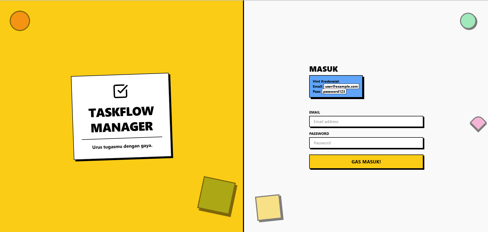
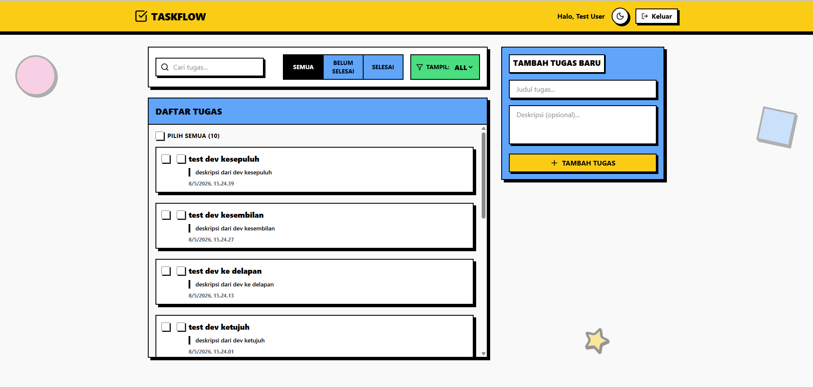
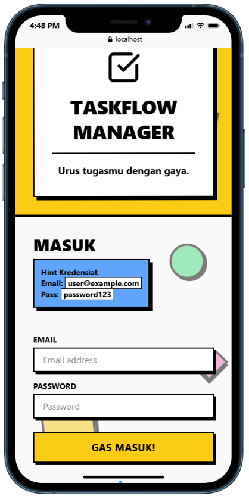
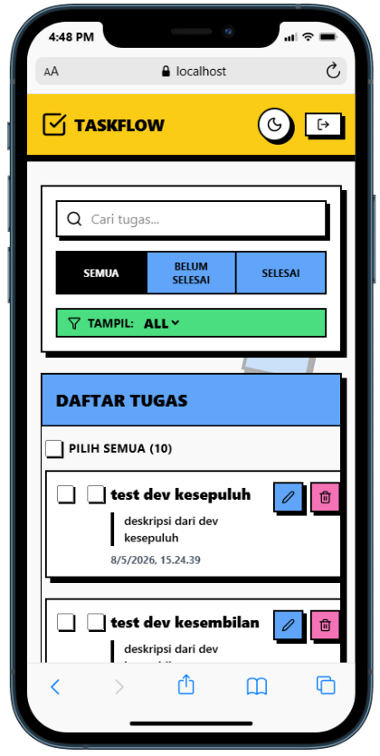

<div align="center">

# ✅ TaskFlow Manager

**Aplikasi manajemen tugas offline dengan simulasi backend (mock API, latensi, autentikasi)**

[](https://reactjs.org/)
[](https://www.typescriptlang.org/)
[](https://tailwindcss.com/)
[](https://vitejs.dev/)
[](https://zustand-demo.pmnd.rs/)
[](https://tanstack.com/query)
[](https://vitest.dev/)

> Dibuat sebagai bagian dari **Frontend Technical Test** — mencakup arsitektur berlapis, state management lanjutan, dan UI/UX premium bergaya Neobrutalism.

</div>

---

## 📋 Daftar Isi

1. [Deskripsi Proyek](#-deskripsi-proyek)
2. [Screenshot Demo](#-screenshot-demo)
3. [Tech Stack](#-tech-stack)
4. [Fitur-Fitur](#-fitur-fitur)
5. [Cara Menjalankan](#-cara-menjalankan-aplikasi)
6. [Struktur Folder](#-struktur-folder)
7. [Asumsi & Keputusan Arsitektur](#-asumsi--keputusan-arsitektur)
8. [Tantangan & Solusi](#-tantangan--solusi)
9. [Self-Evaluation](#-pemenuhan-kriteria-penilaian)
10. [Catatan Tambahan](#-catatan-tambahan)

---

## 📖 Deskripsi Proyek

**TaskFlow Manager** adalah aplikasi manajemen tugas _single-page_ yang berjalan sepenuhnya di sisi klien tanpa memerlukan server backend nyata. Semua operasi data disimulasikan melalui **mock API** dengan latensi buatan (800–1000ms), penyimpanan persisten via **LocalStorage**, serta simulasi error acak (5% probabilitas) untuk mendemonstrasikan kemampuan error handling yang robust.

Proyek ini dibangun untuk memenuhi kriteria technical test yang mencakup:

- **Architectural Abstraction** — pemisahan layer UI, state, dan data
- **State & Async Mastery** — Zustand + React Query dengan Optimistic Updates
- **Code Quality** — TypeScript strict, clean code, dan test coverage
- **UI/UX Excellence** — desain Neobrutalism premium, responsif, dan dark mode

---

## 🖼️ Screenshot Demo

### 🖥️ Tampilan Web (Desktop)

> Layout 2 kolom penuh — branding di kiri, form di kanan (Login) | task list 2/3 + tambah tugas 1/3 (Dashboard)

|                                      Halaman Login                                      |                                      Dashboard Utama                                       |
| :-------------------------------------------------------------------------------------: | :----------------------------------------------------------------------------------------: |
|  |  |
|                     _2-column layout: branding neobrutalism + form_                     |                     _2-column grid: task list (2/3) + add form (1/3)_                      |

---

### 📱 Tampilan Mobile Device

> Layout berubah menjadi 1 kolom penuh — komponen disusun vertikal agar nyaman di layar kecil

|                                         Login Mobile                                          |                                         Dashboard Mobile                                         |
| :-------------------------------------------------------------------------------------------: | :----------------------------------------------------------------------------------------------: |
|  |  |
|                            _Branding di atas, form login di bawah_                            |                        _Navbar sticky, filter bar, task list scrollable_                         |

---

**Fitur UI yang dapat dilihat:**

- 🎨 **Login Page** — Layout 2 kolom (desktop) / 1 kolom (mobile), kolom kiri dengan branding neobrutalism (card miring, warna kuning cerah, dekorasi geometris), kolom kanan berisi form login dengan validasi real-time
- 📋 **Dashboard** — Sticky navbar, grid 2 kolom (task list 2/3 + form tambah 1/3 di desktop), scrollable task list (`max-h-[60vh] overflow-y-auto`), filter bar, bulk action bar
- 🌙 **Dark Mode** — Toggle dengan ikon Sun/Moon di navbar, persisten across refresh via Zustand persist
- 📱 **Responsif** — Layout otomatis berubah dari 2 kolom → 1 kolom di layar ≤ 768px (breakpoint Tailwind `md:`)

---

## 🛠️ Tech Stack

| Kategori               | Library / Tool                 | Versi            | Kegunaan                                   |
| ---------------------- | ------------------------------ | ---------------- | ------------------------------------------ |
| **Core Framework**     | React                          | ^19.2.5          | UI framework                               |
| **Build Tool**         | Vite                           | ^8.0.10          | Dev server & bundler                       |
| **Language**           | TypeScript                     | ~6.0.2           | Static typing                              |
| **Styling**            | Tailwind CSS                   | ^4.2.4           | Utility-first CSS (Neobrutalism)           |
| **State Management**   | Zustand                        | ^5.0.13          | Global state + persist middleware          |
| **Server State**       | TanStack Query (React Query)   | ^5.100.9         | Async state, cache, optimistic updates     |
| **HTTP Client**        | Axios                          | ^1.16.0          | Request interceptor (mock token auth)      |
| **Form Validation**    | React Hook Form + Zod          | ^7.75.0 / ^4.4.3 | Declarative validation & type-safe schemas |
| **Mock Database**      | LocalStorage                   | —                | Persistent task storage                    |
| **Toast Notification** | React Hot Toast                | ^2.6.0           | User feedback untuk operasi CRUD           |
| **Icons**              | Lucide React                   | ^1.14.0          | Icon system                                |
| **Routing**            | React Router DOM               | ^7.15.0          | SPA routing + private route                |
| **Testing**            | Vitest + React Testing Library | ^4.1.5 / ^16.3.2 | Unit & integration testing                 |
| **Test Assertion**     | @testing-library/jest-dom      | ^6.9.1           | DOM assertion matchers                     |

---

## ✨ Fitur-Fitur

### 🔐 Autentikasi

- **Login dengan kredensial hardcoded**
  - Email: `user@example.com`
  - Password: `password123`
- **Persist session** — Status login tersimpan di LocalStorage via Zustand `persist` middleware; refresh halaman tidak akan logout
- **Private Route** — Halaman dashboard hanya dapat diakses oleh pengguna yang sudah login; redirect otomatis ke `/login` jika belum terautentikasi
- **Mock token** — Token `dummy-token-12345` disimpan di state Zustand; Axios instance disiapkan dengan interceptor untuk menyisipkan token ke header request
- **Form Validation** — React Hook Form + Zod schema memvalidasi format email dan panjang minimum password secara real-time

### 📝 Manajemen Tugas (CRUD)

- **Tampilkan daftar tugas** — Data diambil dari LocalStorage menggunakan React Query (`useQuery`) dengan simulasi latensi 800–1000ms; loading spinner ditampilkan selama fetch
- **Tambah tugas baru** — Form dengan validasi (judul wajib diisi); task baru langsung muncul di atas daftar
- **Toggle selesai** — Klik checkbox pada task untuk menandai selesai/belum selesai
- **Hapus tugas** — Tombol hapus pada setiap task item dengan konfirmasi toast
- **⚡ Optimistic Updates** — UI diperbarui _instan_ sebelum respons server dikembalikan; jika terjadi error, state di-rollback ke kondisi sebelumnya secara otomatis melalui `onMutate` / `onError` / `onSettled`

### 🔍 Pencarian & Filter Global (Zustand)

- **Filter status:** Semua | Selesai | Belum Selesai — disimpan di `filterStore` (Zustand)
- **Pencarian real-time** — Filter berdasarkan judul tugas, case-insensitive
- **Paginasi sederhana** — Pilihan jumlah item per halaman: 5, 10, atau All
- Filter aktif bersifat global dan persisten selama sesi berlangsung

### 🗂️ Multi-Select & Bulk Actions

- **Checkbox per task** — Setiap item memiliki checkbox individual
- **Pilih semua** — Checkbox "Pilih Semua" memilih seluruh task yang _sedang tampil_ (berdasarkan filter aktif)
- **Hapus massal** — Hapus semua task yang dipilih dalam satu operasi (`bulkDelete`)
- **Tandai selesai massal** — Tandai semua task terpilih sebagai selesai dalam satu operasi (`bulkComplete`)
- **Bulk Action Bar** — Muncul secara kondisional (hanya saat ada task terpilih) dengan animasi; menampilkan jumlah item terpilih

### 🎨 UI/UX — Neobrutalism Design

- **Neobrutalism aesthetic** — Border hitam tebal (`border-4 border-black`), hard shadow (`shadow-[4px_4px_0px_0px_rgba(0,0,0,1)]`), warna cerah (kuning, biru, pink, hijau), dan tipografi bold uppercase
- **Login layout 2 kolom** — Kolom kiri: branding dengan card miring (efek `rotate` + `hover:rotate-0`); Kolom kanan: form login
- **Sticky Navbar** — Tetap di atas saat scroll (`sticky top-0 z-50`) dengan warna yang berganti saat dark mode
- **Dashboard layout 2 kolom** — Grid `lg:grid-cols-3` dengan task list mengambil 2/3 lebar dan form tambah 1/3
- **Scrollable task list** — List dibatasi tinggi dengan `max-h-[60vh] overflow-y-auto`
- **Dekorasi geometris** — Elemen dekoratif (lingkaran, kotak, segitiga, bintang) di background menggunakan `position: fixed` dan `pointer-events-none`
- **🌙 Dark Mode** — Toggle dengan ikon Sun/Moon di navbar; class `.dark` pada `<html>`, persisten across refresh via Zustand persist
- **📱 Responsif mobile** — Layout berubah dari 2 kolom ke 1 kolom di layar kecil menggunakan breakpoint Tailwind (`md:`, `lg:`)
- **Toast notifications** — Feedback visual untuk setiap operasi sukses/gagal

### 🧪 Testing

- **Unit Tests** — Zustand stores (`authStore`, `filterStore`) dan mock API functions
- **Integration Tests** — Login flow, task CRUD operations, filter behavior, bulk actions, navbar
- **Mock error simulation** — Test mencakup skenario error dari mock API
- **Test environment** — `jsdom` via Vitest dengan setup file untuk `@testing-library/jest-dom`

---

## 🚀 Cara Menjalankan Aplikasi

### Prasyarat

- **Node.js** versi 18 atau lebih baru ([unduh di sini](https://nodejs.org/))
- **npm** (sudah termasuk dalam Node.js) atau **yarn** / **pnpm**

### Langkah-langkah

**1. Clone repository**

```bash
git clone <repo-url>
cd technicaltest-fe-moc
```

**2. Install dependencies**

```bash
npm install
```

**3. Jalankan development server**

```bash
npm run dev
```

Aplikasi akan berjalan di `http://localhost:5173/`

**Kredensial Login:**

```
Email    : user@example.com
Password : password123
```

### Menjalankan Testing

```bash
# Jalankan semua test (watch mode)
npm run test

# Jalankan dengan UI interaktif
npm run test:ui
```

### Build Production

```bash
# Build untuk production
npm run build

# Preview hasil build
npm run preview
```

---

## 📁 Struktur Folder

```
technicaltest-fe-moc/
├── public/                    # Static assets
├── src/
│   ├── api/
│   │   ├── axiosInstance.ts   # Konfigurasi Axios + auth interceptor
│   │   ├── mockApi.ts         # Simulasi CRUD API dengan latensi & error acak
│   │   └── taskQueries.ts     # React Query hooks (useQuery, useMutation + optimistic updates)
│   │
│   ├── components/
│   │   ├── BulkActionBar.tsx  # Bar aksi massal (hapus/selesai) dengan kondisi tampil
│   │   ├── LoginForm.tsx      # Halaman login layout 2 kolom + validasi Zod
│   │   ├── PrivateRoute.tsx   # HOC untuk proteksi rute dashboard
│   │   ├── SearchFilterBar.tsx# Filter status, pencarian, dan perPage
│   │   ├── TaskForm.tsx       # Form tambah tugas baru
│   │   ├── TaskItem.tsx       # Komponen satu baris task (toggle, hapus, checkbox)
│   │   └── TaskList.tsx       # Daftar tugas terfilter + multi-select logic
│   │
│   ├── store/
│   │   ├── authStore.ts       # Zustand: auth state + persist (token, user, darkMode)
│   │   └── filterStore.ts     # Zustand: filter state (status, keyword, perPage)
│   │
│   ├── tests/
│   │   ├── setup.ts           # Konfigurasi test environment (jest-dom)
│   │   ├── unit/
│   │   │   ├── authStore.test.ts    # Unit test: login, logout, toggleDarkMode
│   │   │   ├── filterStore.test.ts  # Unit test: setStatus, setKeyword, setPerPage
│   │   │   └── mockApi.test.ts      # Unit test: getTasks, createTask, deleteTask
│   │   └── integration/
│   │       ├── Login.test.tsx       # Integration test: form validasi & login flow
│   │       ├── TaskList.test.tsx    # Integration test: render list, filter, loading state
│   │       ├── TaskForm.test.tsx    # Integration test: tambah tugas baru
│   │       ├── BulkActions.test.tsx # Integration test: multi-select & bulk operations
│   │       └── Navbar.test.tsx      # Integration test: sticky navbar & logout
│   │
│   ├── types/
│   │   └── index.ts           # TypeScript interfaces: User, Task
│   │
│   ├── utils/
│   │   └── localStorageHelpers.ts # Helper: getFromStorage, setToStorage
│   │
│   ├── App.tsx                # Dashboard layout (Navbar + Grid 2-kolom)
│   ├── main.tsx               # Entry point: Router, QueryClient, Toaster
│   ├── index.css              # Tailwind base + komponen custom (btn-neo, card-neo, dll)
│   └── App.css                # Custom CSS tambahan
│
├── index.html                 # HTML entry point
├── vite.config.ts             # Konfigurasi Vite + plugin React
├── vitest.config.ts           # Konfigurasi Vitest + jsdom environment
├── tsconfig.app.json          # TypeScript config untuk source code
└── package.json               # Dependencies & scripts
```

> **Catatan Arsitektur:** Pemisahan antara `api/` (data layer), `store/` (state layer), dan `components/` (UI layer) diterapkan secara konsisten sesuai kriteria _architectural abstraction_. Setiap layer memiliki tanggung jawab tunggal dan tidak terjadi kebocoran antar-layer.

---

## 🏗️ Asumsi & Keputusan Arsitektur

| #   | Asumsi / Keputusan                                                              | Alasan                                                                                                            |
| --- | ------------------------------------------------------------------------------- | ----------------------------------------------------------------------------------------------------------------- |
| 1   | **Simulasi error 5%** pada setiap operasi mutasi                                | Mendemonstrasikan error handling dan rollback optimistic update secara realistis                                  |
| 2   | **Token mock** disimpan di Zustand state (bukan cookie/sessionStorage terpisah) | Disederhanakan untuk keperluan demo; dalam produksi sebaiknya menggunakan httpOnly cookie                         |
| 3   | **React Query** sebagai satu-satunya sumber kebenaran untuk task data           | Memanfaatkan fitur caching, background refetch, dan invalidasi otomatis setelah mutasi                            |
| 4   | **Zustand persist** untuk sesi login dan dark mode preference                   | Memastikan state tidak hilang setelah refresh tanpa memerlukan backend session                                    |
| 5   | **Tidak menggunakan UI library eksternal** (MUI, Chakra, dll)                   | Tailwind CSS murni digunakan untuk implementasi Neobrutalism custom, menghindari override styling yang berlebihan |
| 6   | **Latensi 800–1000ms** bukan 0ms                                                | Agar optimistic update terlihat nyata dan loading state dapat diuji                                               |
| 7   | **`selectedIds` disimpan di local state** `TaskList`, bukan di Zustand          | Tidak perlu global karena hanya digunakan dalam satu komponen; menghindari over-engineering                       |
| 8   | **`perPage`** diimplementasikan sebagai slice array, bukan true pagination      | Cukup untuk demonstrasi; data selalu di-fetch sekaligus dari LocalStorage                                         |
| 9   | **Dark mode** dikelola via CSS class `.dark` pada `<html>`                      | Kompatibel dengan Tailwind dark mode variant tanpa library tambahan                                               |
| 10  | **Zod schema** dipisah di dalam komponen form                                   | Untuk kesederhanaan; dalam proyek besar sebaiknya dipindah ke `src/schemas/`                                      |

---

## 💡 Tantangan & Solusi

### 1. Optimistic Updates dengan React Query

**Tantangan:** Memastikan UI langsung berubah sebelum respons server, tetapi tetap aman jika server gagal — tanpa menyebabkan tampilan "berkedip" atau data tidak konsisten.

**Solusi:**

```typescript
onMutate: async (newData) => {
  // 1. Batalkan query yang sedang berjalan agar tidak overwrite optimistic state
  await queryClient.cancelQueries({ queryKey: ['tasks'] });

  // 2. Simpan snapshot data sebelumnya untuk rollback
  const previousTasks = queryClient.getQueryData<Task[]>(['tasks']);

  // 3. Update cache secara optimistis
  queryClient.setQueryData<Task[]>(['tasks'], (old) => [...]);

  return { previousTasks }; // konteks untuk rollback
},
onError: (_err, _vars, context) => {
  // 4. Rollback ke snapshot jika error
  queryClient.setQueryData(['tasks'], context?.previousTasks);
},
onSettled: () => {
  // 5. Invalidasi query agar data sync dengan "server"
  queryClient.invalidateQueries({ queryKey: ['tasks'] });
},
```

---

### 2. Multi-Select + Bulk Actions dengan Filter Aktif

**Tantangan:** `selectedIds` tidak boleh berisi ID task yang sedang _tersembunyi_ oleh filter aktif, karena bisa menyebabkan operasi bulk pada task yang tidak terlihat oleh pengguna.

**Solusi:** `selectedIds` disimpan sebagai state lokal di `TaskList`. "Pilih Semua" hanya mengambil ID dari `filteredTasks` (hasil filter), bukan dari seluruh data mentah. Saat filter berubah, selection yang tersisa di luar filter dianggap tidak aktif secara implisit karena komponen hanya meneruskan `selectedIds` yang masih ada di `filteredTasks`.

```typescript
const handleSelectAll = (checked: boolean) => {
  // Hanya pilih dari task yang sedang tampil (post-filter)
  if (checked) setSelectedIds(filteredTasks.map((t) => t.id));
  else setSelectedIds([]);
};
```

---

### 3. Layout 2 Kolom dengan Scrollable Task List

**Tantangan:** Membuat kolom kiri scrollable secara internal sementara form di kolom kanan tetap _sticky_ (tidak ikut scroll), tanpa mempengaruhi overall page layout.

**Solusi:** Kombinasi CSS Grid dengan `items-start` agar kolom tidak stretch, dan `max-h-[60vh] overflow-y-auto` pada container task list agar hanya area tersebut yang scrollable.

```jsx
{
  /* Dashboard: grid 2 kolom, kolom kanan tidak ikut scroll list */
}
<div className="grid grid-cols-1 lg:grid-cols-3 gap-8 items-start">
  <div className="lg:col-span-2">
    {/* Task list dengan scroll internal */}
    <div className="max-h-[60vh] overflow-y-auto">
      <TaskList />
    </div>
  </div>
  <div className="lg:col-span-1">
    <TaskForm /> {/* Tetap di posisi awal */}
  </div>
</div>;
```

---

### 4. Konsistensi Neobrutalism Shadow di Dark Mode

**Tantangan:** Hard shadow khas neobrutalism (`box-shadow: 4px 4px 0px black`) kehilangan kontras di dark mode karena background gelap mendekati warna shadow.

**Solusi:** Mendefinisikan utility class custom di `index.css` yang menggunakan shadow hitam solid secara konsisten, dan memastikan komponen card selalu memiliki border hitam eksplisit sebagai pembatas visual, bahkan di dark mode.

```css
/* index.css — custom neobrutalism components */
.card-neo {
  @apply border-4 border-black shadow-[4px_4px_0px_0px_rgba(0,0,0,1)] rounded-none;
}
.btn-neo {
  @apply border-2 border-black shadow-[4px_4px_0px_0px_rgba(0,0,0,1)] 
         hover:shadow-none hover:translate-x-1 hover:translate-y-1 
         transition-all font-bold;
}
```

---

## 📊 Pemenuhan Kriteria Penilaian

| Kriteria                      | Bobot | Status       | Implementasi di Proyek                                                                                                                                                      |
| ----------------------------- | ----- | ------------ | --------------------------------------------------------------------------------------------------------------------------------------------------------------------------- |
| **Architectural Abstraction** | 35%   | ✅ Terpenuhi | Layer terpisah: `api/` (data), `store/` (state), `components/` (UI), `types/` (contracts). Tidak ada logika bisnis di dalam komponen UI.                                    |
| **State & Async Mastery**     | 30%   | ✅ Terpenuhi | Zustand untuk client state + persist; React Query untuk server state; Optimistic Updates dengan rollback otomatis pada semua operasi mutasi (create, update, delete, bulk). |
| **Code Quality**              | 20%   | ✅ Terpenuhi | TypeScript strict di seluruh codebase; interface yang terdefinisi jelas; custom hooks untuk separation of concerns; unit + integration tests dengan Vitest.                 |
| **UI/UX & Error Handling**    | 15%   | ✅ Terpenuhi | Neobrutalism design system custom; dark mode; responsif mobile; react-hot-toast untuk semua feedback; error state UI saat fetch gagal; loading spinner saat data dimuat.    |

**Fitur Opsional yang Diimplementasikan:**

- [x] Multi-Select & Bulk Actions (hapus massal + tandai selesai massal)
- [x] Dark Mode dengan persist
- [x] Paginasi per-halaman (5, 10, All)
- [x] Dekorasi geometris animatif di background
- [x] Unit tests + integration tests

---

## 📝 Catatan Tambahan

### 🔗 Links

- **Repository GitHub:** `https://github.com/abdulmajid34/technicaltest-fe-moc.git`
- **Live Demo:** `https://taskflow-manager.abdulmajidti.my.id/`

### 🧑‍💻 Tentang Proyek Ini

Proyek ini diselesaikan sebagai bagian dari technical test frontend. Seluruh kode ditulis tanpa UI library eksternal (hanya Tailwind CSS murni), dengan fokus pada demonstrasi kemampuan dalam:

- Arsitektur frontend yang terstruktur dan dapat di-_maintain_
- Penggunaan lanjutan React Query (optimistic updates, caching, background sync)
- State management yang tepat (Zustand untuk global state yang benar-benar perlu global)
- Testing yang bermakna (bukan hanya snapshot test, tapi behavior test)
- Desain UI yang premium dan konsisten tanpa bergantung pada library siap pakai

### 🙏 Terima Kasih

Terima kasih kepada tim reviewer yang telah menyediakan waktu untuk mengevaluasi proyek ini. Semua feedback sangat diapresiasi dan akan menjadi bahan pembelajaran yang berharga. 🚀

## 👤 Author

**Technical Test Frontend — MOC (TaskFlow Manager Web App)**  
Built with ❤️ by **Abdul Majid** using ReactJS + TailwindCSS v4 + TypeScript
